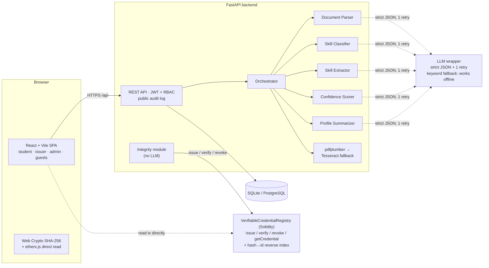

# Attesta — verified student credentials

> AI agents analyze evidence, issuers confirm, SHA-256 hashes are anchored on-chain, and anyone can verify a file without trusting Attesta's servers.

**DecentraHack 2.0** — themes: Agentic AI · Blockchain/Web3 · Open Source. Live offline demo: 9 October 2026.

## What it does

Students upload certificates, projects and internship letters. Five AI agents read the documents, map skills onto a standard taxonomy, and compare them to a target career. The student reviews and approves the extracted skills, then a college issuer confirms the evidence and its SHA-256 hash is written to a public blockchain. From then on, anyone — recruiters especially — can verify a file in the browser and get one of five answers, with cryptographic proof:

| State | Meaning |
|---|---|
| `Unverified` | Extracted by the agents, or awaiting the student's skill approval and the issuer's confirmation. **Never proof of authenticity.** |
| `Verified` | On-chain record exists **AND** file hash matches **AND** not revoked. |
| `Revoked` | The original issuer revoked it. Reason and timestamp are public. |
| `Tampered` | The presented hash differs from the anchored hash for that credential. Changed hex characters are highlighted. |
| `Not found` | The hash is anchored nowhere on the registry (public verify page only). |

## Why blockchain (and why nothing else)

Several independent issuers (colleges, employers, hackathon organizers) write credential records, and any recruiter can check them **without trusting Attesta's servers or a single database owner**. The chain gives tamper-evidence: once anchored, nobody — not even us — can quietly rewrite a credential hash.

The chain stores **only**: credential ID, document hash, issuer address, recipient address, timestamp, revoked flag. **No tokens, no trading, no speculation.** PDFs, images, passwords, ID numbers, phone numbers, emails and names never go on-chain.

The registry keeps a **reverse index from document hash to credential ID**, so a bare file hash alone is enough to find its record. And the proof is re-checkable at the edge: the receipt page reads the issuance transaction **directly from the node with ethers.js in your browser**, so the verdict does not depend on Attesta's API being honest.

## Recruiters are guests. There is no recruiter login.

A student publishes exactly one share link (a long random token, with a QR code). A recruiter opens the link or scans the code and sees, with no account and no login: status per credential, skill cards with confidence, on-chain proof (file hash, transaction hash, block, timestamp, issuer address) and the agent trace. There is **no directory, no search, no profile enumeration, and no file downloads**; unknown tokens return 404.

## Features

1. Public **Verify any file** page: drop a file, the browser computes SHA-256 (Web Crypto), the app resolves the hash through the registry's reverse index and shows Verified / Revoked / Tampered / Not found with issuer, block number, transaction hash and a side-by-side hash comparison that highlights the changed hex characters. An optional credential-ID field enables the Tampered check without the receipt.
2. **Student approval gate**: extracted skills stay a suggestion until the student approves them; only approved evidence reaches the issuer's queue, and the issuer cannot anchor anything unapproved.
3. **Agent Trace** panel: every agent run with input summary, output, confidence, flags, duration, and whether the deterministic fallback was used.
4. **Share link + QR code**: one token per student, minted from the student dashboard, leading to the guest recruiter view.
5. **Guest job match**: recruiters paste a job description inside the share view; the score counts verified skills only, unverified matches listed separately.
6. **Admin one-click tamper**: the demo admin flips one byte in a stored copy of a credential's document; the credential page immediately shows HASH MISMATCH with the differing hex highlighted, the on-chain record stays untouched, and an off-chain tamper-detection entry is written. Plus a Reset demo data button.
7. **Skill graph** (React Flow): verified and unverified nodes differ by border style and label, never by color alone.
8. **Revocation** with reason and timestamp, visible on the public verify page.
9. **Issuer CSV bulk issuance** (columns: student_email, title, file_name), respecting the same approval gate.
10. **Public audit log**: registry events (issued, revoked) read from chain events plus off-chain tamper-detection entries labeled "off-chain" — hashes, addresses, transaction hashes and timestamps only. No names, no emails, no file names.

## Architecture



The LLM layer is provider-agnostic (OpenAI-compatible). With no API key everything still works: a deterministic keyword-and-taxonomy fallback produces good results on the seeded certificates, so the demo never depends on the internet.

## Quickstart (3 commands)

```bash
./make install        # backend venv + frontend + blockchain deps
./make chain          # start the local Hardhat node and deploy the registry
./make check-all      # tests, build, seed the demo data, drive the full demo
```

Then run the app:

```bash
./make demo-check     # already proven by the gate; to serve manually:
cd backend && .venv/Scripts/uvicorn app.main:app --port 8000     # Windows venv path: .venv\Scripts\
cd frontend && npm run dev
```

- Web app: http://localhost:5173
- API health: http://localhost:8000/api/health
- OpenAPI docs: http://localhost:8000/docs

On Linux/macOS use `make` instead of `./make` (same targets; the Makefile delegates to `scripts/make.py`).

## Demo accounts

One click each on the login page — no passwords to type on stage:

| Role | Email | Sees |
|---|---|---|
| Student | `student@attesta.demo` | Uploads, agent trace, skill approval, career gap, share link + QR |
| Issuer | `issuer@attesta.demo` | Approval queue (approved evidence only), on-chain anchoring, CSV bulk, revoke |
| Admin | `admin@attesta.demo` | Reset demo data, one-click tamper |

Recruiters never log in: they open the student's share link or scan its QR code.

Sample data is labeled "Sample data" everywhere it appears. `./make seed` (or the admin's Reset demo data button) rebuilds: 1 student, 1 college issuer, 1 admin; 3 real certificate PDFs (Python verified, SQL issued-then-revoked, Excel left unverified); 1 pre-staged tampered copy; 2 projects; a guest share token.

## Project structure

```
trustpass/
├── frontend/          React SPA (12 pages; React Flow, Recharts, QR, ethers v6)
├── backend/
│   ├── app/           FastAPI app, routers, agents, services, chain adapter
│   └── tests/         63 API tests + 23 agent tests (run with no API key)
├── blockchain/        VerifiableCredentialRegistry + 15 Hardhat tests + deploy script
├── scripts/           make.py gate runner, seed_demo.py, demo_check.py
├── data/              skills.json taxonomy (82 skills), roles.json, chain.json (generated)
├── docs/              assumptions, architecture, trust model, demo script, slides
├── render.yaml        one-click Render blueprint for the backend
├── Makefile + make    identical gate targets for CI and the Windows demo laptop
└── .github/workflows  CI: lint + contract + backend + frontend tests
```

## API

Interactive OpenAPI docs at `/docs` on the running backend. The response envelope is always `{"error": {"code", "message", "details"}}` on failure; trust states are the five canonical strings above.

## Trust model

Every credential shows exactly one status, and only the deterministic Integrity module — never an LLM — may set `Verified`, `Revoked` or `Tampered`. Details and the transition diagram: [docs/trust-model.md](docs/trust-model.md). Autonomous decisions taken while building: [docs/ASSUMPTIONS.md](docs/ASSUMPTIONS.md).

## Privacy and security

Guests see only what a share token exposes; there is no way to enumerate profiles or files, and guests cannot download documents. Documents stay off-chain in local storage behind a storage-adapter interface (IPFS stub). Passwords are bcrypt-hashed, auth is JWT with role-based access, uploads are type- and size-validated, and no secrets are committed (`.env.example` holds placeholders only). The demo issuer key is Hardhat's well-known account #0 — worthless outside the local node.

## License

MIT — see [LICENSE](LICENSE).
